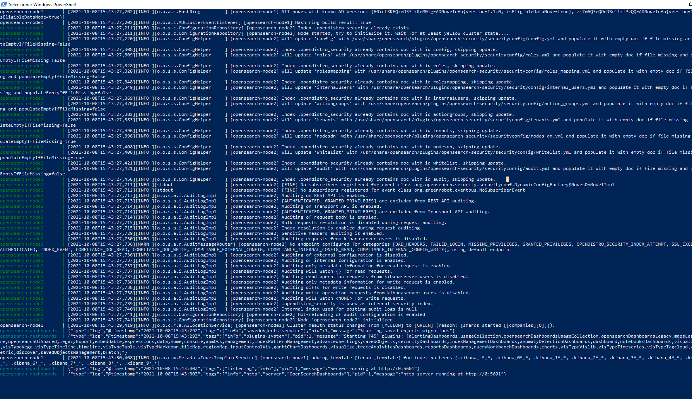
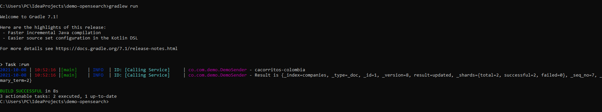

# This project is a demo for using OpenSearch in your local environment

## first things first :+1:

## What do you need?

:co:
:white_check_mark: install docker
:white_check_mark: Jdk 11
:white_check_mark: an account with aws (sing your credentials with STS)

set its max memory to at least 6GB, this due to OpenSearch is memory hungry

In windows you can add to `%PROFILEUSER%/.wslconfig` the following

    [wsl2]
    memory=10GB # Limits VM memory in WSL 2
    processors=4 # Makes the WSL 2 VM use 4 virtual processors
    localhostForwarding=true # Boolean specifying if ports bound to wildcard or localhost in the WSL 2 VM should be connectable from the host via localhost:port

however, this works only if you use Docker with Windows Subsystem for Linux (WSL2)

if the above did not work, you can try using this in a powershell/terminal:

    wsl -d docker-desktop sysctl -w vm.max_map_count=262144

This work ONLY for the instance where you run your OpenSearch instance

so, the following you will need is create a folder where you save the following file:

### Configuring OpenSearch with 2 nodes in a local environment

make a pull to the next docker images:

```shell
$ docker pull opensearchproject/opensearch
$ docker pull opensearchproject/opensearch-dashboards
```

then create a `docker-compose.yml` file in a folder of your preference

```yaml
version: '3'
services:
  opensearch-node1:
    image: opensearchproject/opensearch
    container_name: opensearch-node1
    environment:
      - cluster.name=opensearch-cluster
      - node.name=opensearch-node1
      - discovery.seed_hosts=opensearch-node1,opensearch-node2
      - cluster.initial_master_nodes=opensearch-node1,opensearch-node2
      - bootstrap.memory_lock=true # along with the memlock settings below, disables swapping
      - "OPENSEARCH_JAVA_OPTS=-Xms512m -Xmx512m" # minimum and maximum Java heap size, recommend setting both to 50% of system RAM
    ulimits:
      memlock:
        soft: -1
        hard: -1
      nofile:
        soft: 65536 # maximum number of open files for the OpenSearch user, set to at least 65536 on modern systems
        hard: 65536
    volumes:
      - opensearch-data1:/usr/share/opensearch/data
    ports:
      - 9200:9200
      - 9600:9600 # required for Performance Analyzer
    networks:
      - opensearch-net
  opensearch-node2:
    image: opensearchproject/opensearch
    container_name: opensearch-node2
    environment:
      - cluster.name=opensearch-cluster
      - node.name=opensearch-node2
      - discovery.seed_hosts=opensearch-node1,opensearch-node2
      - cluster.initial_master_nodes=opensearch-node1,opensearch-node2
      - bootstrap.memory_lock=true
      - "OPENSEARCH_JAVA_OPTS=-Xms512m -Xmx512m"
    ulimits:
      memlock:
        soft: -1
        hard: -1
      nofile:
        soft: 65536
        hard: 65536
    volumes:
      - opensearch-data2:/usr/share/opensearch/data
    networks:
      - opensearch-net
  opensearch-dashboards:
    image: opensearchproject/opensearch-dashboards
    container_name: opensearch-dashboards
    ports:
      - 5601:5601
    expose:
      - "5601"
    environment:
      OPENSEARCH_HOSTS: '["https://opensearch-node1:9200","https://opensearch-node2:9200"]' # must be a string with no spaces when specified as an environment variable
    networks:
      - opensearch-net

volumes:
  opensearch-data1:
  opensearch-data2:

networks:
  opensearch-net:
```

The first node is opensearch-node1 the second one ends with node2, for more info you can
check [OpenSearchDoc](https://opensearch.org/docs/latest/dashboards/install/docker/)

```shell
$ cd "working_dir"/docker-compose.yml
$ docker-compose up
```

after that you must see something similar to this:



then you can run this project with

```shell
gradle run
```

then you can see something like this


